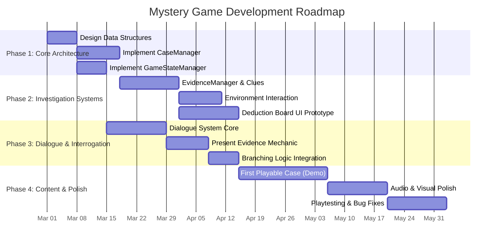

# Project Timetable and Milestones

This document outlines the development schedule and key milestones for transitioning the current project into a mystery/detective game.

## Development Roadmap

## Key Milestones

### Milestone 1: Core Architecture Complete (Target: Mid-March 2026)
*   **Goal:** Establish the foundational data structures required for a mystery game.
*   **Deliverables:**
    *   `CaseManager` is functional and can load basic case data (suspects, locations).
    *   `GameStateManager` is implemented to track global boolean flags (e.g., `HasFoundWeapon`).
    *   Data formats (JSON or ScriptableObjects) for cases are finalized.

### Milestone 2: Investigation Mechanics (Target: Mid-April 2026)
*   **Goal:** Allow the player to explore environments and collect clues.
*   **Deliverables:**
    *   `EvidenceManager` is working; players can pick up and store clues in an inventory.
    *   Basic interaction system for inspecting 2D/3D objects in the scene.
    *   A functional prototype of the Deduction Board UI where clues can be viewed.

### Milestone 3: Interrogation System (Target: Mid-May 2026)
*   **Goal:** Implement the core dialogue and interrogation loop.
*   **Deliverables:**
    *   `DialogueManager` can parse and display branching conversations.
    *   Players can "Present Evidence" during dialogue to unlock new branches or catch suspects in lies.
    *   Dialogue branches correctly read from and write to the `GameStateManager`.

### Milestone 4: First Playable Case / Vertical Slice (Target: Mid-June 2026)
*   **Goal:** A complete, playable, short mystery case from start to finish.
*   **Deliverables:**
    *   One fully written and implemented case (e.g., a simple locked-room mystery).
    *   All systems (Investigation, Interrogation, Deduction) working together seamlessly.
    *   The player can successfully solve the case and trigger a "Case Closed" state.

### Milestone 5: Polish and Beta (Target: July 2026)
*   **Goal:** Refine the experience based on feedback and finalize assets.
*   **Deliverables:**
    *   Integration of final art and audio assets (utilizing existing `MusicManager` and `SceneTransitionManager`).
    *   UI/UX improvements to the Deduction Board and Dialogue interfaces.
    *   Bug fixing and performance optimization.